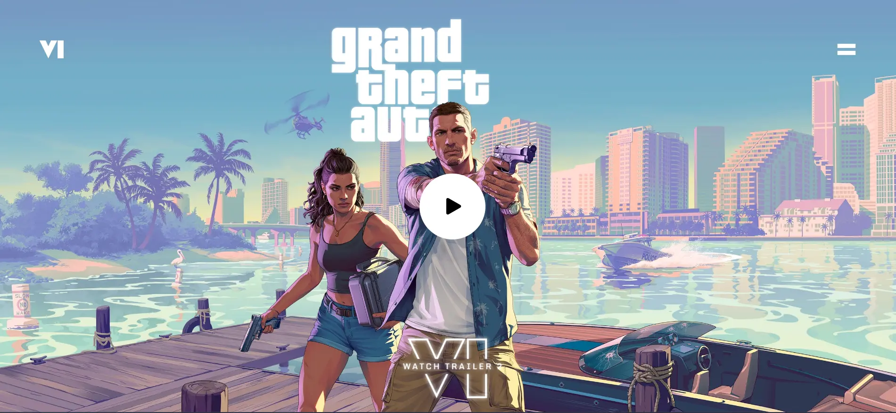
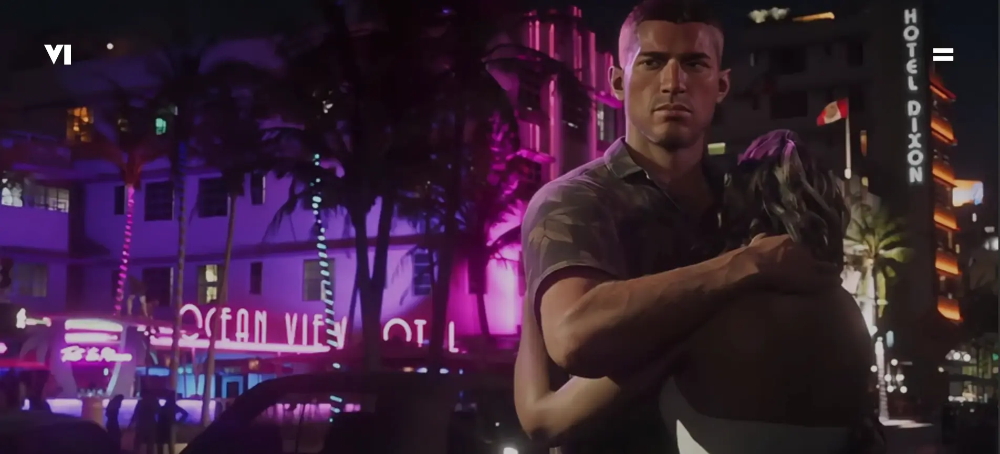
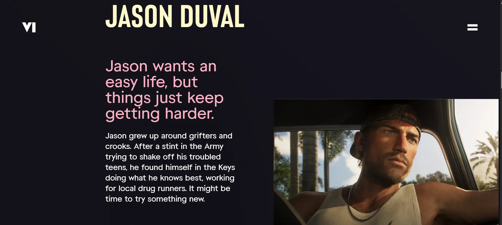
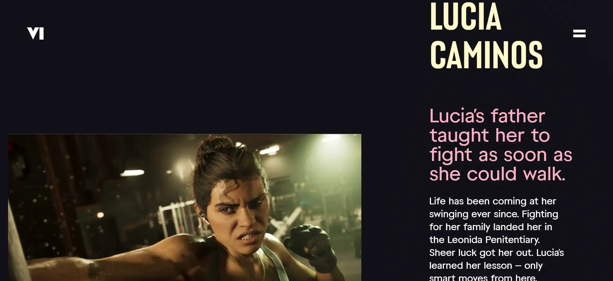
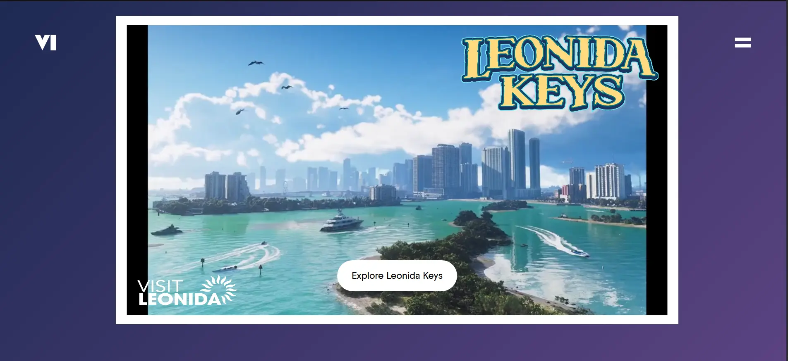
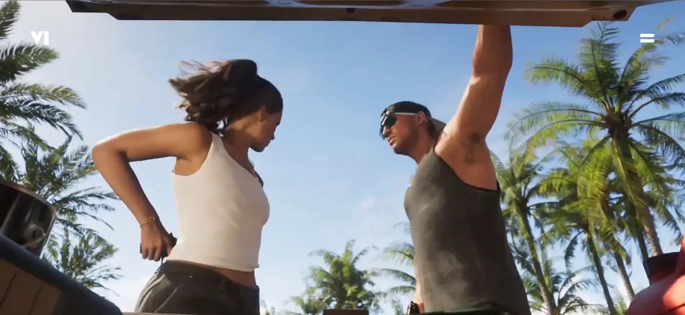
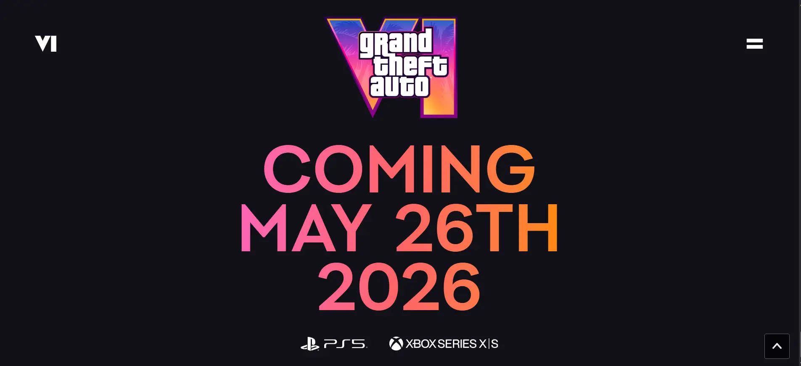

# 🕹️ GTA VI Landing Page

A cinematic, scroll-driven GTA VI landing page experience - powered by **React**, **Tailwind CSS**, and **GSAP**.  
Inspired by the storytelling and visual momentum of **GTA VI**, this project reimagines iconic trailer moments through advanced web animations and layout techniques - all built entirely with frontend technologies.

Built entirely with frontend technologies, it showcases how modern animation and layout tools can deliver a visually immersive web experience.



---

## 🚀 Live Demo

[👉 View Live Demo](https://gta-vi-landing-page-three.vercel.app/)

---

## ✨ Features

- 🎬 Scroll-triggered animations using **GSAP + ScrollTrigger**
- 📱 Fully **responsive layout** for mobile, tablet, and desktop
- 📽️ Hero background video and layered cinematic sections
- 👤 Jason and Lucia character intros with animated imagery
- 🎞️ Parallax-first & second video transitions
- 🏝️ Gradient postcard section with layered overlays
- 🎥 Final outro section that plays a scroll-synced video

---

## 📸 Sections Breakdown

| Section       | Description                                          |
| ------------- | ---------------------------------------------------- |
| Hero Section  | Intro trailer reveal with CTA and masked typography  |
| First Video   | Parallax-like entry into GTA VI footage              |
| Jason Section | Scroll-pinned story reveal with layered imagery      |
| Second Video  | Lucia intro with pinned clip and GSAP transition     |
| Lucia Life    | Lucia’s story with dynamic layout & scrolling effect |
| Postcard      | Leonida Keys teaser with animated background         |
| Final Outro   | Scroll-synced cinematic exit video                   |

---

## 🖼️ Visual Previews

> Scroll through some snapshots of key sections:

### 🎬 Hero Section


### 🎥 First Video Transition



### 🕵️ Jason Character Reveal



### 🔥 Lucia Life Story



### 🌅 Postcard Animation



### 🎞️ Final Scroll Animation (Outro)



### 🎞️ Outro Section Overview



---

## 🛠️ Built With

- ⚛️ **React** – SPA structure & component logic
- 🎨 **Tailwind CSS** – Utility-first styling
- 🎞️ **GSAP + ScrollTrigger** – Scroll animations & video timelines
- 🖼️ **Custom Fonts** – For Rockstar-inspired typography
- 💻 **Responsive Design** – Mobile-first layout strategy

---

## 🧠 Inspiration

This project is an homage to Rockstar Games and the cinematic presentation of GTA VI. Inspired by its storytelling and visual momentum, it reimagines key trailer moments using advanced web animations and layout techniques - built entirely with frontend technologies.

---

## 🖥️ Run Locally

Follow these steps to set up and run the project on your local machine:
To run this project on your local machine:

1. **Clone the repository**  
   Copy the repo link and clone it using Git. Then navigate into the project folder.

   ```bash
   git clone https://github.com/onkar-03/gta-vi-landing-page.git
   cd gta-vi-landing-page
   ```

2. **Install dependencies**  
   Use your preferred package manager (`npm`, `pnpm`, etc.) to install all required dependencies.

   ```bash
   npm install
   ```

   or

   ```bash
   pnmp install
   ```

3. **Start the development server**
   Run the development script to start a local dev server.

   ```bash
   npm run dev
   ```

   or

   ```bash
   pnpm dev
   ```

4. **Open in your browser**
   Navigate to the port shown in your terminal to view the project.
